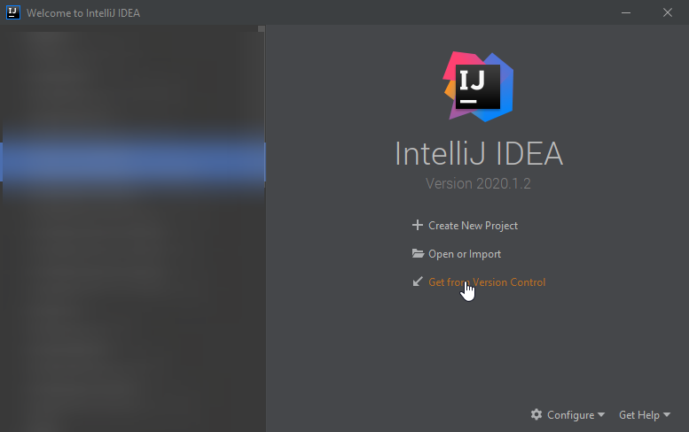

# Документация JM StackOverflow
## Работа с git
### Клонирование проекта

1. На странице репозитория убедитесь, что выбрана ветка **dev** (1), нажмите кнопку **Clone** (2), скопируйте ссылку (3).


2. Откройте **Intellij IDEA**, нажмите **Get from version control** на экране приветствия, либо **VCS | Git | Clone...** в меню.




3. Вставьте скопированную ссылку в строку **URL**, нажмите **Clone**.


### Перед внесением изменений в код
Создайте новую ветку в git-репозитории и работайте в ней. Для этого:
1. Нажмите на текущую ветку **dev** в правом нижнем углу.


2. Выберите **New branch**.


3. Введите название своей новой ветки (на ваше усмотрение) и нажмите **Create**.


### Добавление своего кода в общий репозиторий. Git push.

Прежде чем создать merge request вам необходимо подготовить вашу ветку к отправке в общий репозиторий.

1. Нажмите на текущую ветку в правом нижнем углу. Выберите опцию **dev | update**. 
Таким образом вы скачаете в свою локальную ветку **dev** все коммиты которые были замержены, 
пока вы работали в своей ветке.


2. Убедитесь, что в данный момент активна ваша рабочая ветка (занчек ярлыка слева от имени, как у ветки my-branch на скриншоте).
Выберите опцию **dev | Merge into Current**. Таким образом вы добавите все изменения из ветки **dev** в вашу ветку. При возникновении конфликтов разрешите их.


3. ---**ВАЖНО**--- Убедитесь что проект собирается и запускается.

4. Выберите вашу ветку и нажмите на **Push...** чтобы добавить её в общий репозиторий.


### Создание merge request

1. Создайте новый merge request. В качестве **Source branch** выберите свою ветку, **Target branch** - **dev**.


2. Проверьте данные, допишите комментарии при необходимости. Обратите внимание на опцию **Delete source branch when merge request is accepted**.
Завершите создание реквеста, приложите ссылку на него в карточку таска на Trello.


## Как настроить запуск
- Скачайте и установите PostgreSQL 11 или 12 версии.
- Создайте базу данных и схему в ней, настройте доступ к БД в IntellijIdea (название БД, схемы, пользователя и пароль
 см. application-local.properties).
- В проекте реализованно два профиля: **local** и **dev**. Для выбора профиля, добавьте в program arguments
 (Run->Edit Configurations)**--spring.profiles.active=local** или **--spring.profiles.active=dev** соответственно.
 
  
  
  
- если в директории test папка resources не установлена в качестве источника ресурсов, зайти в Project Structure Modules
и поставить отметку на папке.

   
  
  
- для корректной работы MapStruct назначить Maven выполнение операции clean перед каждым запуском приложения. Для чего
перейти к настройкам конфигурации запуска приложения (Run->Edit Configurations) и в поле Before launch
(выполнить прокрутку до самого низа окна) добавить задачу Maven clean. Простым перетаскиванием установить ее перед 
Build.


  

- установите плагин Lombok. Перейдите File → Settings → Plugins. В открывшемся окне плагинов введите «Lombok» в строке
 поиска, а нажмите кнопку «Install».


## Сущности


##Как пользоваться конвертором MapStruct.

**MapStruct** - это генератор кода, который значительно упрощает реализацию сопоставлений между типами Java-компонентов
 на основе подхода соглашения по конфигурации.
Сгенерированный код сопоставления использует простые вызовы методов 
и, следовательно, является быстрым, безопасным по типам и простым для понимания.
Более подробно можно ознакомиться в официальной документации:https://mapstruct.org/ .

В текущем проекте **Developer Social** технология **MapStruct** используется,в основном, для 
преобразования **Dto** в **Entity** и наоборот.
Названия всех классов преобразования должны заканчиваться на «**Converter**» (например: **GroupChatConverter**) и должны храниться в пакете **converters**.
Такой класс должен быть абстрактным, помеченным аннотацией **@Mapper**.Эта аннотация отмечает класс
как класс сопоставления и позволяет процессору **MapStruct** включиться во время компиляции.
Методы должны быть абстрактными,из их названия должно быть явно понятно,какой класс
во что преобразуется. Например: (**chatDtoToGroupChat**- преобразует **ChatDto** в **GroupChat**).

Если соответствующие поля двух классов имеют разные названия, для их сопоставления
используется аннотация **@Mapping**. Эта аннотация ставится над абстрактным методом преобразования
и имеет следующие обязательные поля:

**source** - исходное поле преобразовываемого класса.
**target**- конечное поле класса,в котором должно быть значение из **source**.

Для разрешения неоднозначностей в именах полей классов можно указывать их с именем
соответствующего параметра метода преобразования.
например:(**source** = "**chatDto.title**", где **chatDto** - имя параметра метода преобразования)

По умолчанию, метод должен принимать объект преобразовываемого класса, но также
можно передовать различные другие параметры(например **Id**) и потставлять их в **source**,
чтобы в дальнейшем поле **target** приняло это значение.

Могут возникнуть ситуации,что нужно преобразовать поле в другой тип данных,например 
в коллекцию и наоборот.Тогда в аннотацию **@Mapping** следует добавить еще одно поле:
**qualifiedByName**, которое будет содержать имя метода, реализующего логику получения
нужного типа или значения. В таком случае этот метод должен быть помечен аннотацией
**@Named** c указанием названия для маппинга.
Ниже приведён общий пример:

````
{@Mapping(source = "chatDto.title", target = "title")
    @Mapping(source = "chatDto.image", target = "image")
    @Mapping(source = "userId",target ="users",qualifiedByName = "userIdToSet")
    public abstract GroupChat chatDtoToGroupChat(ChatDto chatDto,Long userId); }"
   

@Named("userIdToSet")
    public  Set<User> userIdToSet(Long userId) {
        User user = userService.getById(userId);
        Set<User> userSet = new HashSet<>();
        userSet.add(user);
        return userSet;
    }


